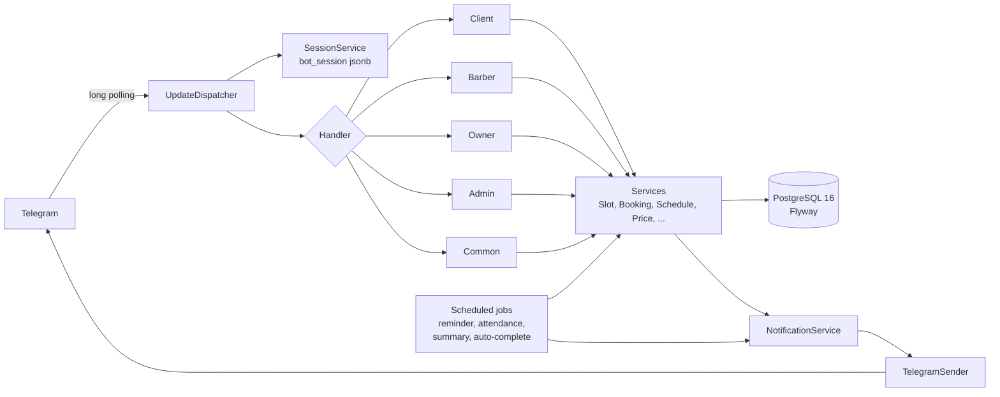

# Navbat — sartaroshxonalar uchun Telegram bron boti

Bitta bot orqali ko'p sartaroshxonaga xizmat ko'rsatadigan (multi-tenant) navbat boti. Mijoz sartaroshni tanlaydi,
narxlarni ko'radi (faqat ma'lumot uchun), bo'sh vaqtni tanlaydi va bron qiladi. To'lov **faqat naqd, joyida**.

- **Mijoz** — sartarosh tanlaydi, bo'sh vaqtni ko'radi, bron qiladi, bekor qiladi. Eslatma oladi.
- **Sartarosh** — bronlarni ko'radi, narxlar, ish vaqti, tanaffus, dam olish kunlari, qo'lda bron, statistika.
- **Sartaroshxona egasi** — sartaroshxona ma'lumotlari, sartaroshlarni qo'shish/o'chirish, mijozlar uchun **havola va QR kod**.
- **Super admin** — sartaroshxona yaratadi, obunani yoqadi/o'chiradi, umumiy statistika.

Tillar: **o'zbekcha (lotin)** va **ruscha**.

Texnologiyalar: Java 21 (virtual threads), Spring Boot 4.1, PostgreSQL 16 + Flyway, TelegramBots 10 (long polling),
ZXing (QR), Gradle, Docker.

---


## 1. Sinov stsenariysi (ikkita Telegram akkaunt kerak)

1. **Super admin** akkauntida botni oching: `/start` → til → telefon raqamni yuboring. So'ng `/admin` →
   **➕ Yangi sartaroshxona** → nomini yozing. Bot **egasi uchun havola** beradi (`https://t.me/<bot>?start=o_...`).
2. Havolani egasiga yuboring (o'zingizda ham sinash mumkin). Egasi havolani ochib sozlash ustasidan o'tadi: nom, manzil, mo'ljal,
   joylashuv, telefon, rasm.
3. "Siz ham shu yerda sartarosh bo'lib ishlaysizmi?" → **Ha** (yoki keyin **👥 Sartaroshlar → 💈 Men ham sartaroshman**).
4. Sartarosh sozlash ustasi: ism, bir navbat davomiyligi, **ish vaqti**, **tanaffus**, kamida bitta **narx**.
5. **🔗 Havola va QR** bo'limidan mijozlar uchun havolani va QR kodni oling.
6. **Ikkinchi Telegram akkaunt**dan (mijoz) shu havolani oching → til → telefon → sartarosh kartasi (narxlar) →
   **📅 Bo'sh vaqtlarni ko'rish** → kun → vaqt → **✅ Tasdiqlash**.
7. Sartarosh akkauntiga **🆕 Yangi bron!** xabari keladi. Mijoz **📋 Mening bronlarim** orqali bekor qilishi mumkin —
   sartaroshga xabar boradi.
8. Sartaroshda: **📅 Bugun**, **🗓 Jadval**, **➕ Qo'lda bron**, **🚫 Vaqtni yopish**, **📊 Statistika**.
9. `/admin` → **📋 Sartaroshxonalar** → sartaroshxonani **o'chirish (obuna tugadi)**: mijozlar endi bron qila olmaydi.

Eslatmani tez sinash uchun sartaroshxona sozlamalarida **Eslatma** muddatini o'zgartiring. Botni to'xtatib qayta ishga
tushirsangiz ham suhbat holati va ma'lumotlar yo'qolmaydi (ular bazada saqlanadi).

## 1.1. Test uchun tayyor (soxta) ma'lumotlar

Qo'lda hamma narsani kiritib o'tirmaslik uchun bot **soxta sartaroshxonalar, sartaroshlar, narxlar, ish vaqti, yopilgan
vaqtlar va bronlar** yaratib bera oladi. `.env` fayliga qo'shing:

```
DEMO_DATA=true
```

Bot ishga tushganda bir marta quyidagilarni yaratadi (yana ishga tushirsangiz takrorlanmaydi):

- 7 ta sartaroshxona (`demo-` bilan boshlanadigan slug): jumladan ruscha nomli, bitta sartaroshli (tanlash bosqichi
  o'tkazib yuboriladi), obunasi **o'chirilgan** ("VIP Style") va 5 tadan ko'p faol sartaroshxona (ro'yxat sahifalanishini
  sinash uchun).
- Har birida sartaroshlar (biri "bron qabul qilmaydi" ⛔), narxlar, haftalik ish vaqti, tanaffus, dam olish kuni.
- **Yopilgan vaqtlar** (bugun/ertaga/indinga: qisman va butun kun) va **soxta bronlar**: o'tgan kunlar uchun
  keldi / kelmadi / bekor qilingan (statistika uchun), bugun va keyingi kunlar uchun faol bronlar va qo'lda yozilgan bronlar.
- `SUPER_ADMIN_IDS` dagi birinchi id egasi **"Barber House" egasi va sartarosh** bo'ladi, shuning uchun bitta akkaunt bilan
  sartarosh va ega menyusini ham sinab ko'rish mumkin (mijoz rejimi tugmasi bilan almashing). Boshqa id uchun
  `DEMO_STAFF_TELEGRAM_ID=...`, o'chirish uchun `DEMO_STAFF_TELEGRAM_ID=none`.

Sanalar bugungi kunga nisbatan yaratiladi. Eskirganda yangilash uchun `DEMO_DATA_RESET=true` qo'ying: faqat `demo-`
ma'lumotlari o'chirilib, qaytadan yaratiladi (sizning haqiqiy ma'lumotlaringizga tegmaydi). Soxta odamlar Telegram id'lari
`9000000000–9000000999` oralig'ida, shuning uchun bot ularga hech qachon xabar yubormaydi.

> Faqat sinov uchun. Productionda `DEMO_DATA=false` qoldiring.

## 2. Loyiha tuzilishi

```
src/main/java/pdp/service_bron/
├── config/      BotProperties, ClockConfig, TelegramConfig, BotRunner, BotCommandsSetup, SchedulingConfig
├── telegram/    UpdateDispatcher, TelegramSender, KeyboardFactory, CallbackData, HtmlEscaper, BotContext
├── handler/     UpdateHandler + client/ barber/ owner/ admin/ common/   (faqat parse + render, biznes mantiq yo'q)
├── session/     SessionService, BotState, Session   (suhbat holati bazada, jsonb)
├── domain/      JPA entity'lar va enum'lar
├── repository/  Spring Data repository'lar
├── service/     SlotService, BookingService, ScheduleService, PriceService, BarberService, ShopService,
│                InviteService, NotificationService, QrService, StatsService, I18nService, AccessService, UserService
├── scheduler/   ReminderJob, AttendanceJob, DailySummaryJob, AutoCompleteJob, SessionCleanupJob
└── util/        TimeFormatter, PhoneFormatter, SlugUtil, MoneyFormatter, TimeParser, CompactTime
src/main/resources/
├── db/migration/V1__init.sql        sxema (double booking'ga qarshi exclusion constraint bilan)
├── messages_uz.properties           barcha matnlar (o'zbekcha)
└── messages_ru.properties           barcha matnlar (ruscha)
```



**Muhim qoidalar**

- Handler'larda biznes mantiq yo'q; servislar `Clock` orqali ishlaydi va test qilish oson.
- Ikki mijoz bir vaqtda bir slotni bossa, faqat bittasi yozildi: bazadagi `booking_no_overlap` exclusion constraint
  buni kafolatlaydi, `BookingService` xatoni ushlab "vaqt band bo'ldi" deb ko'rsatadi.
- Har bir callback ruxsatni qayta tekshiradi (id'larga ishonilmaydi). `callback_data` 64 baytdan oshmaydi.
- Foydalanuvchi matnlari HTML-escape qilinadi. Telefon raqamlar loglarda maskalanadi (`+99890***4567`).
- Java kodida foydalanuvchiga ko'rinadigan matn yo'q: hammasi `messages_*.properties` da.

## 3. Testlar va CI

```bash
./gradlew build          # kompilyatsiya + barcha testlar (Docker ishlab turishi kerak: Testcontainers PostgreSQL)
```

- Unit testlar: slot mantiqi, `CallbackData`, formatlovchilar, joblar, i18n (uz va ru kalitlari mos kelishi).
- Integratsion testlar (Testcontainers + PostgreSQL 16): bron va bir vaqtdagi 10 ta so'rov (faqat bittasi yutadi), jadval,
  takliflar, sessiya, hamda botning to'liq stsenariysi (`BotFlowIT`).
- GitHub Actions: `.github/workflows/ci.yml` har push va pull request'da `./gradlew build` ni ishga tushiradi.

## 4. Muammolarni hal qilish

| Belgi | Sabab va yechim |
|---|---|
| `TELEGRAM_BOT_TOKEN is empty` | `.env` faylida tokenni to'ldiring. |
| `Cannot authorize the Telegram bot` | Token noto'g'ri yoki `api.telegram.org` ga ulanish yo'q. |
| Dastur baza xatosi bilan to'xtaydi (dev) | Docker Desktop ishlab turganini tekshiring. |
| Havolada `t.me/null?start=...` | `TELEGRAM_BOT_USERNAME` bo'sh va bot hali ulanmagan; `.env` da to'ldiring. |
| Bot javob bermayapti | Bir tokenni faqat bitta dastur nusxasi ishlatishi mumkin (long polling). Boshqa nusxani to'xtating. |
| QR kodda nom ko'rinmaydi (Docker) | Runtime image'da `fontconfig` va shrift kerak; `Dockerfile` ularni o'rnatadi. |
